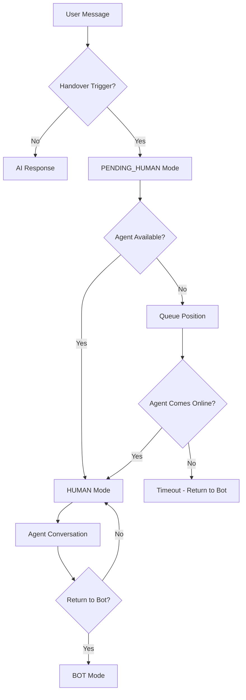

# 🤝 Bot-to-Human Handover System Guide

## Overview

The **Bot-to-Human Handover System** enables seamless transitions from AI chatbot conversations to human agents when users request human assistance or when specific triggers are detected. This system maintains conversation context, manages agent queues, and provides a comprehensive dashboard for human agents.

## 🏗️ System Architecture

### Core Components

```
📁 Handover System Structure
├── 🔧 Configuration
│   └── src/config/handover_config.py - Trigger keywords, messages, settings
├── 🧠 Detection & Processing
│   ├── src/handlers/handover_detector.py - Trigger detection logic
│   └── src/core/handover_manager.py - Conversation mode management
├── 🌐 API Layer
│   └── src/api/handover_routes.py - REST endpoints for agents
├── 🎨 User Interface
│   └── templates/agent_dashboard.html - Human agent dashboard
└── 💾 Database Schema
    └── docs/handover_database_schema.sql - Database structure
```

### Conversation Flow States



## 🚀 Features

### 1. **Intelligent Trigger Detection**
- **Keyword Detection**: Recognizes phrases like "human", "agent", "support"
- **Escalation Patterns**: Detects frustration indicators
- **Priority Assessment**: Categorizes requests as urgent, high, medium, or normal
- **Department Routing**: Suggests appropriate department (technical, billing, sales, support)

### 2. **Conversation Mode Management**
- **BOT Mode**: AI handles conversation automatically
- **PENDING_HUMAN Mode**: User in queue waiting for agent
- **HUMAN Mode**: Human agent actively handling conversation
- **PAUSED Mode**: Conversation temporarily paused

### 3. **Agent Dashboard**
- **Real-time Queue**: View pending handover requests
- **Active Conversations**: Manage ongoing human conversations
- **One-click Takeover**: Seamlessly take control of conversations
- **Message Interface**: Send messages directly to customers
- **Return to Bot**: Hand conversation back to AI when resolved

### 4. **Queue Management**
- **Priority-based Ordering**: Urgent requests handled first
- **Wait Time Estimation**: Inform customers of expected wait times
- **Capacity Management**: Prevent queue overflow
- **Auto-timeout**: Return to bot if no agent available

## 📋 Configuration

### Handover Triggers

Edit `src/config/handover_config.py` to customize:

```python
HANDOVER_KEYWORDS = [
    'human', 'agent', 'support', 'help me', 'real person',
    'talk to someone', 'customer service', 'representative'
]

HANDOVER_PHRASES = [
    'i want to talk to',
    'connect me to',
    'speak with a human'
]
```

### Business Hours

```python
HANDOVER_SETTINGS = {
    'business_hours': {
        'start': 9,   # 9 AM
        'end': 18,    # 6 PM
        'timezone': 'Asia/Kolkata'
    }
}
```

### Priority Keywords

```python
'priority_keywords': {
    'urgent': ['urgent', 'emergency', 'asap', 'immediately'],
    'complaint': ['complaint', 'refund', 'cancel', 'disappointed'],
    'technical': ['not working', 'error', 'bug', 'broken']
}
```

## 🛠️ Setup Instructions

### 1. Database Setup

Apply the handover database schema:

```sql
-- Run the SQL commands from docs/handover_database_schema.sql
-- This adds handover tables and updates existing conversations table
```

### 2. Install Dependencies

```bash
# Install required Python packages
pip install pytz  # For timezone handling
```

### 3. Configure Environment

Update your `.env` file if needed:

```env
# Existing configuration remains the same
# No additional environment variables required
```

### 4. Start the Application

```bash
python3 app.py
```

### 5. Access Agent Dashboard

Navigate to: `http://localhost:5001/agent-dashboard`

## 🔌 API Endpoints

### Queue Management

```http
GET /api/handover/queue
# Returns current handover queue

GET /api/handover/conversations/human
# Returns active human conversations

GET /api/handover/stats
# Returns dashboard statistics
```

### Agent Actions

```http
POST /api/handover/takeover
Content-Type: application/json

{
    "user_id": "919876543210@s.whatsapp.net",
    "agent_id": "agent_001",
    "agent_name": "Sarah Johnson"
}
```

```http
POST /api/handover/return-to-bot
Content-Type: application/json

{
    "user_id": "919876543210@s.whatsapp.net",
    "agent_id": "agent_001"
}
```

```http
POST /api/handover/send-message
Content-Type: application/json

{
    "user_id": "919876543210@s.whatsapp.net",
    "message": "Hello! I'm here to help you.",
    "agent_id": "agent_001"
}
```

### Conversation Status

```http
GET /api/handover/status/{user_id}
# Returns current conversation mode

PUT /api/handover/status/{user_id}/mode
Content-Type: application/json

{
    "mode": "human",
    "agent_id": "agent_001",
    "reason": "manual_update"
}
```

## 💬 User Experience

### Customer Journey

1. **Normal Conversation**: User chats with AI bot
2. **Trigger Detection**: User says "I need to talk to a human"
3. **Handover Message**: Bot responds "Let me connect you to our support agent..."
4. **Queue Status**: If agents busy: "You're #2 in queue. Estimated wait: 5 minutes"
5. **Agent Takeover**: "Hi! I'm Sarah from Rian Infotech and I'm here to help you personally"
6. **Human Conversation**: Direct communication with human agent
7. **Return to Bot**: "Thank you for the conversation! I'm back to assist you automatically"

### Agent Experience

1. **Dashboard Monitoring**: View real-time queue and active conversations
2. **Takeover Decision**: Click "Take Over" on pending requests
3. **Customer Context**: See conversation history and analysis
4. **Direct Messaging**: Send messages through dashboard or external tools
5. **Conversation Management**: Return to bot when issue resolved

## 🔍 Monitoring & Analytics

### Dashboard Metrics

- **Queue Size**: Number of pending handover requests
- **Active Conversations**: Conversations with human agents
- **Average Wait Time**: Time customers wait for agents
- **Agent Availability**: Online/busy/offline status

### Logging

The system logs all handover events:

```python
# Example log entries
INFO - Handover keyword detected: 'human'
INFO - Handover triggered for 919876543210: keyword_detected
INFO - Set conversation mode for 919876543210 to pending_human
INFO - Agent Sarah Johnson took over conversation with 919876543210
INFO - Conversation returned to bot for 919876543210
```

## 🧪 Testing the System

### 1. Test Trigger Detection

Send these messages to trigger handover:

```
"I need to talk to a human"
"This bot is not helping"
"Connect me to customer service"
"I want to speak with an agent"
```

### 2. Test Agent Dashboard

1. Open `http://localhost:5001/agent-dashboard`
2. Trigger a handover from WhatsApp
3. See the request appear in the queue
4. Take over the conversation
5. Send a message to the customer
6. Return the conversation to bot

### 3. Test API Endpoints

```bash
# Check handover stats
curl http://localhost:5001/api/handover/stats

# Check queue
curl http://localhost:5001/api/handover/queue

# Test takeover
curl -X POST http://localhost:5001/api/handover/takeover \
  -H "Content-Type: application/json" \
  -d '{"user_id":"919876543210@s.whatsapp.net","agent_id":"test_agent","agent_name":"Test Agent"}'
```

## 🔧 Customization

### Adding New Trigger Keywords

```python
# In src/config/handover_config.py
HANDOVER_KEYWORDS.extend([
    'escalate',
    'manager',
    'supervisor'
])
```

### Custom Priority Logic

```python
# In src/handlers/handover_detector.py
def _determine_priority(message: str) -> str:
    # Add custom priority logic
    if 'vip' in message.lower():
        return 'urgent'
    # ... existing logic
```

### Custom Department Routing

```python
# In src/handlers/handover_detector.py
def _suggest_department(message: str) -> str:
    department_keywords = {
        'technical': ['api', 'integration', 'webhook'],
        'billing': ['invoice', 'payment', 'subscription'],
        # Add more departments
    }
```

## 🚨 Troubleshooting

### Common Issues

1. **Handover not triggering**
   - Check keyword configuration
   - Verify message processing flow
   - Check logs for detection events

2. **Agent dashboard not loading**
   - Verify Flask routes are registered
   - Check browser console for errors
   - Ensure API endpoints are accessible

3. **Database errors**
   - Verify handover schema is applied
   - Check Supabase connection
   - Review table permissions

4. **Messages not sending**
   - Verify WaSender API configuration
   - Check conversation mode status
   - Review WhatsApp handler logs

### Debug Mode

Enable detailed logging:

```python
import logging
logging.getLogger('src.core.handover_manager').setLevel(logging.DEBUG)
logging.getLogger('src.handlers.handover_detector').setLevel(logging.DEBUG)
```

## 🔮 Future Enhancements

### Planned Features

1. **Real-time Notifications**: WebSocket-based live updates
2. **Agent Performance Metrics**: Response times, satisfaction scores
3. **Advanced Routing**: Skills-based agent assignment
4. **Multi-language Support**: Trigger detection in multiple languages
5. **Integration APIs**: Connect with external CRM systems
6. **Mobile Agent App**: Native mobile app for agents
7. **Voice/Video Handover**: Escalate to voice/video calls
8. **AI-Assisted Agents**: Suggest responses to human agents

### Scalability Considerations

- **Load Balancing**: Distribute agent dashboard across multiple servers
- **Database Optimization**: Index optimization for large conversation volumes
- **Caching**: Redis for real-time queue management
- **Microservices**: Split handover system into separate services

## 📞 Support

For questions or issues with the handover system:

1. Check the logs in the application console
2. Review this documentation
3. Test with the provided API endpoints
4. Contact the development team

---

**🎉 Congratulations!** You now have a fully functional bot-to-human handover system that provides seamless customer experience and efficient agent management. 